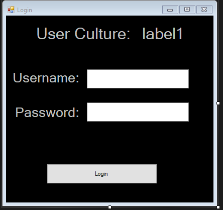
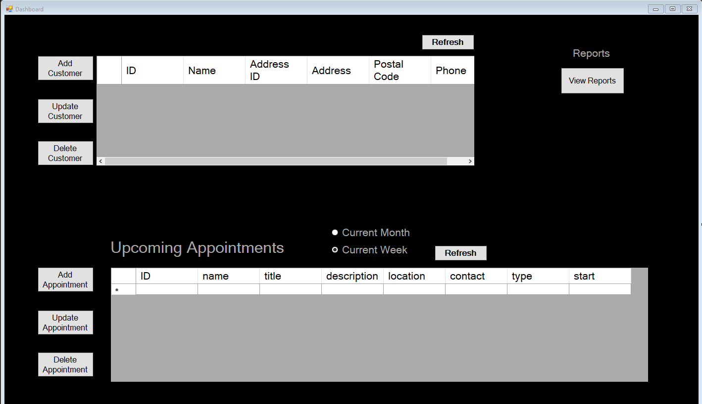
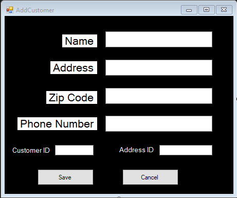
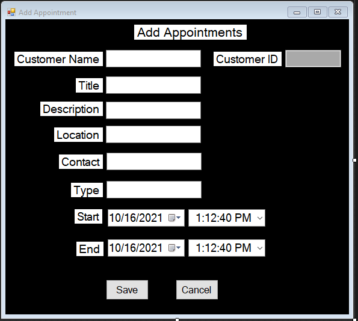
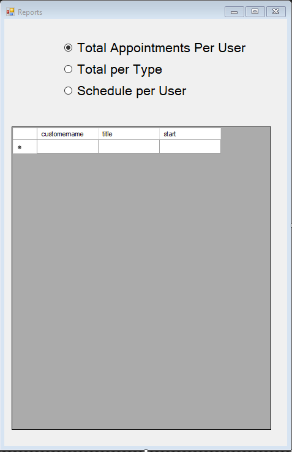

# DesktopScheduler

This project connects to an external database from Western Governor's University, since I have graduated the database access has been terminated. I will go over the project regardless, as I am quite proud of this project.

The user logins to the database, and the language of the login page will adjust between French and English depending on the user's Windows region settings. After logging in there are two data grids, one that shows the total customers, and one that shows the upcoming appointments either by the current week or the current month. All appointments, and customers are able to be created, updated, deleted.

There is also a reports page that has 3 pre-generated reports that allow the user to see the total appointments per user, total per type, and the appointments associated with each employee. 

Login Page, with placeholder user culture.

The dashboard the user is greeted too after logging in.

The add customer page. There is data validation for each field.

The add appointment page. There is data validation for every field, including the date pickers. You can't pick a date in the past for example.

The reports page, with 3 radio buttons that swap between the pre-generated reports.

